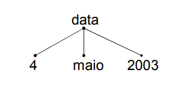

# Prolog

Programação baseada em lógica matemática.

## Tipos de dados

Todo tipo de dado em prolog é chamado de `termo` que por sua vez pode classificado como:

1. **Variável**

   - Qualquer sequência de caracteres, números e/ou underscore que é precedida (<s>... a sequência</s>) por uma **letra maiúscula** _(ex: Isto, Monkey_And_Banana)_.
   - Qualquer sequência de caracteres, números e/ou underscore que é precedida por um **underscore** \_(ex: \_Isto, \_Monkey_And_Banana)
   - Um underscore simples (`_`). Neste caso a variável é denominada **variável anónima**. Cada variável anónima é diferente da outra ou seja, `_` é diferente de `_`.

2. **Constante**
   1. **Átomo**
      - Qualquer coisa entre aspas simples `''` _(ex: 'Paulo')_.
      - Qualquer sequência de caracteres, números e/ou undescore que é precedida por uma **letra minúscula** _(ex: um_atomo, e25, etc)_.
      - Qualquer sequência contínua de símbolos _(ex: \*\*\*\*+\*\*\*\*\*)_.
      - E muitos outros simbolos como `[]` que identificam listas vazias e a vírgula `,` que simboliza conjunção entre outros.
   2. **Número** - representa números inteiros _(ex: 12, 20, 77)_ e números de ponto flutuante _(ex: 7.77, 45.3)_.
3. **Estrutura composta**
   - _Objectos de dados que possuem vários componentes_.
   - Cada componente pode ser uma estrutura.
   - De forma a combinar componentes em um simples objecto, deve-se escolher um functor.
   - Todos objectos estruturados podem ser representados como árvores. Exemplo: a data pode ser dividida em `dia, mês e ano`. Em forma de functor podemos representar 3 de maio de 2003 como `data(dia, mês, ano)`.

<div style="text-align:center">

<br>
_Fig.1 Data functor representation_

</div>

## Operadores

### Operadores lógicos

Por se tratar de uma linguagem baseada em lógica matemática estes operadores são os mais importantes a se conhecer dentro da linguagem.

1. **Conjunção**: é representada por vírgula `,`.
2. **Disjunção**: é representada por dois pontos e vírgula `;`.
3. **Negação**: é representada por `\+`.

### Operadores aritméticos

| Operação         | Simbolo |
| ---------------- | ------- |
| Adição           | -       |
| Subtração        | +       |
| Multiplicação    | \*      |
| Divisão          | /       |
| Divisão inteira  | //      |
| Resto da divisão | mod     |
| Potência         | \*\*    |
| Atribuição       | is      |

### Operadores relacionais

| Operação               | Simbolo  |
| ---------------------- | -------- |
| X é maior do que Y     | X > Y    |
| X é menor do que Y     | X < Y    |
| X é maior ou igual a Y | X >= Y   |
| X é menor ou igual a Y | X <= Y   |
| X é igual a Y          | X =:= Y  |
| X unifica com Y        | X = Y    |
| X é diferente de Y     | X =\\= Y |

## Cláusulas, Regras e Factos

Uma cláusula em prolog ou é uma **regra** ou um **facto**. O _ponto `.`_ no final das sentenças é sempre necessário, pode ser interpretado como o `;` nas linguagens de programação tradicionais.

- Uma **regra** possui o formato:

  ```prolog
  Cabecalho :- Corpo.
  ```

  O `:-` representa `<-` e pode ser lido como, **Cabecalho é verdadeiro se o Corpo for verdadeiro**.

- Cláusulas sem corpo são chamadas de **factos**:
  ```prolog
  Cabecalho.
  ```

> Todo programa em prolog é uma sequência de cláusulas que definem os valores contidos e o que procede a partir disso.

### Exemplo

```prolog
cor(vermelho).
cor(verde).
cor(azul).
```

- Estes factos definem um predicado/functor com um argumento (`cor/1`).
- O número de argumentos é chamado de **aridade** do predicado.

> "cor(X) é válido se X for vermelho, verde ou azul."

```prolog
tres_cores(X, Y, Z) :-
            cor(X),
            cor(Y),
            cor(Z).
```

Podemos ler este **regra** como uma implicação, i.e, _"**Se** X é uma cor, **e** Y é uma cor, **e** Z é uma cor então `tres_cores(X, Y, Z)` se verifica."_

Por se tratarem de conceitos relacionados à lógica relacional, esta regra poderia ainda ser lida como _"`tres_cores(X, Y, Z)` se verifica se X é uma cor, Y é uma cor e Z é uma cor"_.

Cada conjunto _(cor(X), cor(Y) e cor(Z))_ é chamado de **objectivo**. E cada objectivo restringe o conjunto de soluções.
